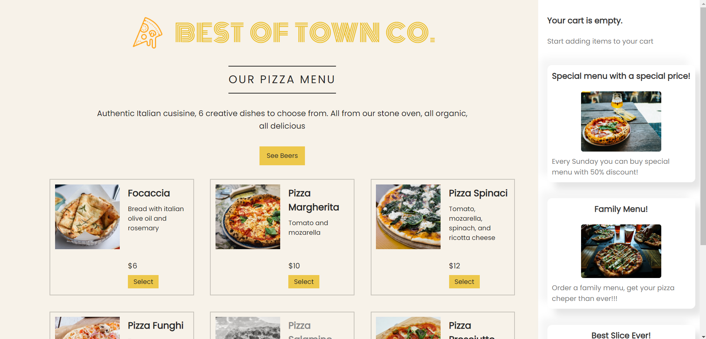
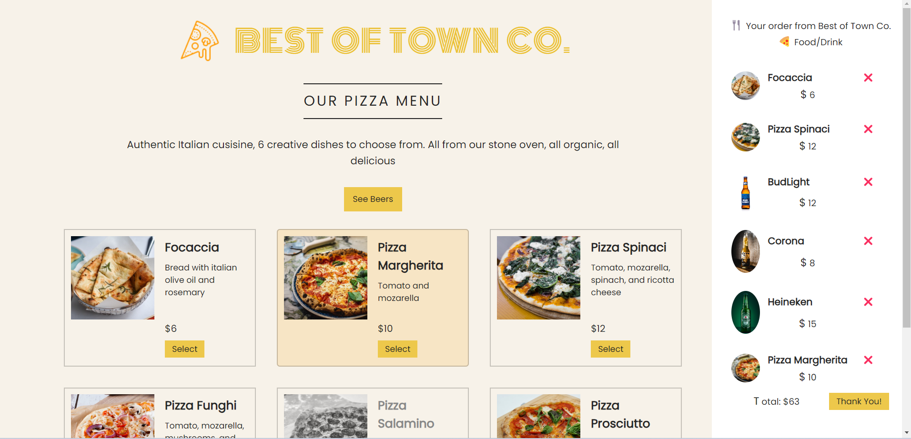

# 🍕🍺 Menu made with React

Menu for online order made by React.

# Built with

- JavaScript, React(v18.2)

# Reach the App

You need to follow these steps to reach the project
1-Clone the repo
2-In the project directory, you can run `npm install`
3-Run `npm start`

You can reach the project here, [menu](https://berenvrl.github.io/ordermenu-react/)

# Visual of the project

